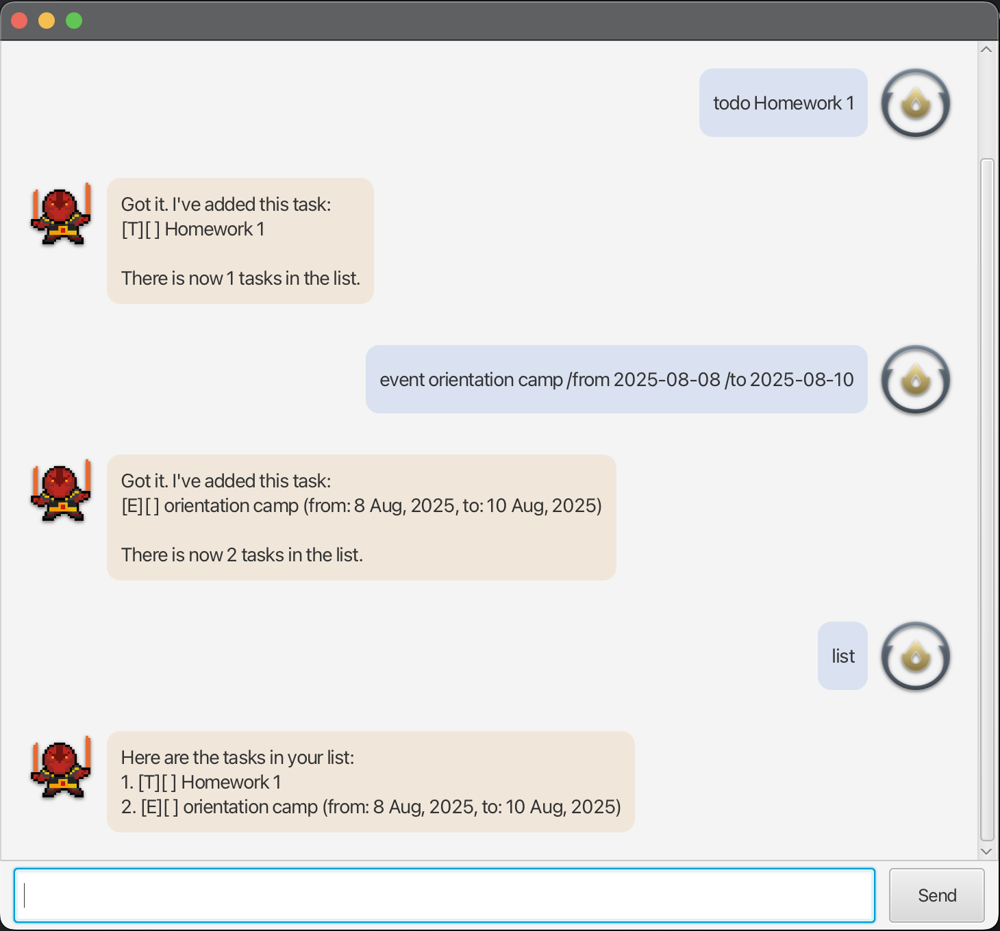

# Ember — Task Manager

Ember is a fast, lightweight desktop application that helps you **track todos, deadlines, and events**.  
Type your commands, hit Enter, and let Ember keep your life organised.

> Requires **Java 11 or above**.

---

## Quick Start
1. Download the latest `ember.jar` from the Releases page.
2. Place it in any folder you like.
3. Open a terminal in that folder and run
4. Start entering the commands described below.

---

## Command Reference

| Action                | Format & Example | What happens |
|-----------------------|------------------|--------------|
| **Add todo**          | `todo TASK`   e.g. `todo borrow book` | Adds a task with no date |
| **Add deadline**      | `deadline TASK /by YYYY-MM-DD`   e.g. `deadline return book /by 2025-10-15` | Adds a task that must be done before a date |
| **Add event**         | `event TASK /from YYYY-MM-DD /to YYYY-MM-DD`   e.g. `event project meeting /from 2025-10-20 /to 2025-10-21` | Adds a task that spans a date range |
| **List tasks**        | `list` | Shows all tasks |
| **Mark task done**    | `mark INDEX`   e.g. `mark 2` | Marks task #2 as done |
| **Unmark task**       | `unmark INDEX`   e.g. `unmark 2` | Marks task #2 as not done |
| **Delete task**       | `delete INDEX`   e.g. `delete 3` | Removes task #3 |
| **Find tasks**        | `find KEYWORD`   e.g. `find book` | Lists tasks containing *book* |
| **Sort by name**      | `sort name` | Lists tasks alphabetically |
| **Sort by date**      | `sort date` | Lists tasks earliest-first |
| **Exit**              | `bye` | Saves data and closes app |

---

## Data Storage
All tasks are saved automatically to `temp/lines.txt` every time you modify the list.  
Your data is reloaded the next time you run Ember—no extra steps needed.

---

*Happy tasking with Ember!* 🚀
